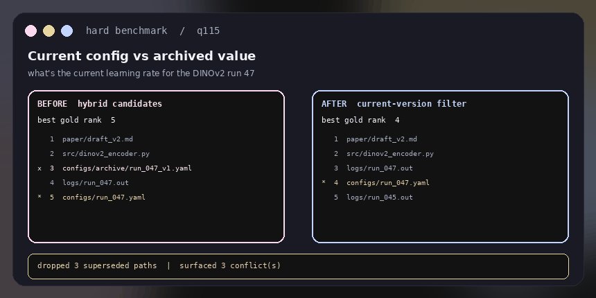
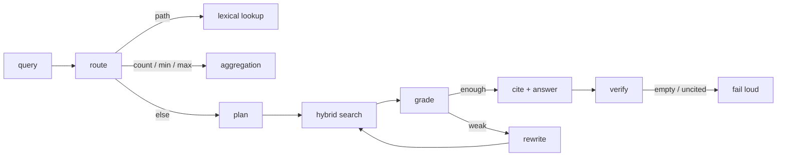
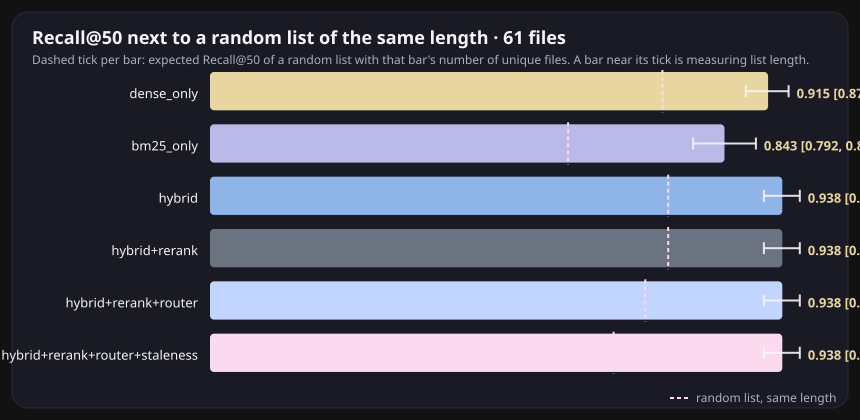
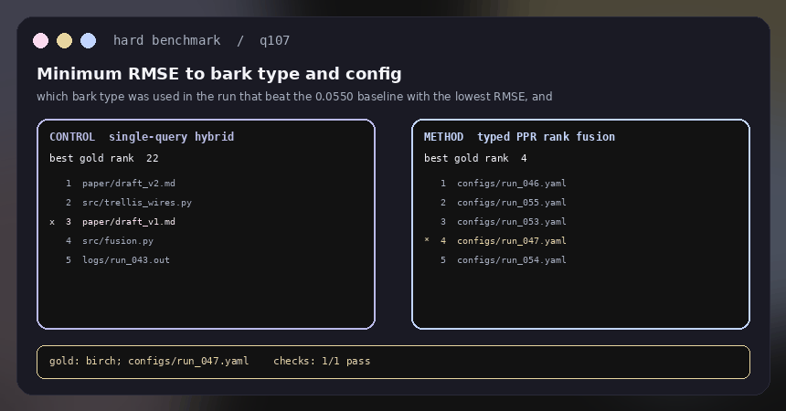
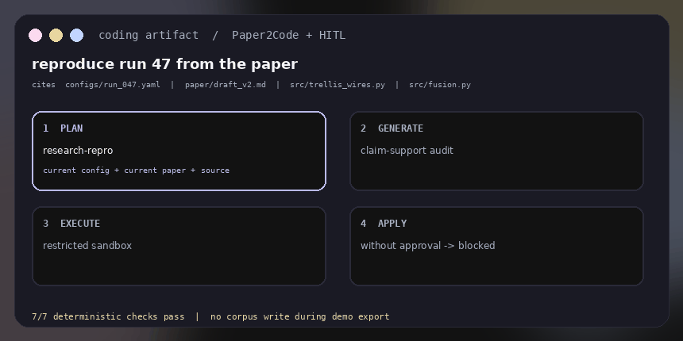
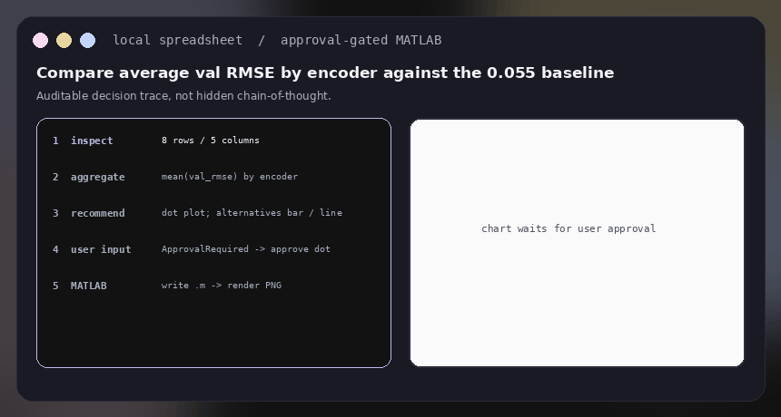
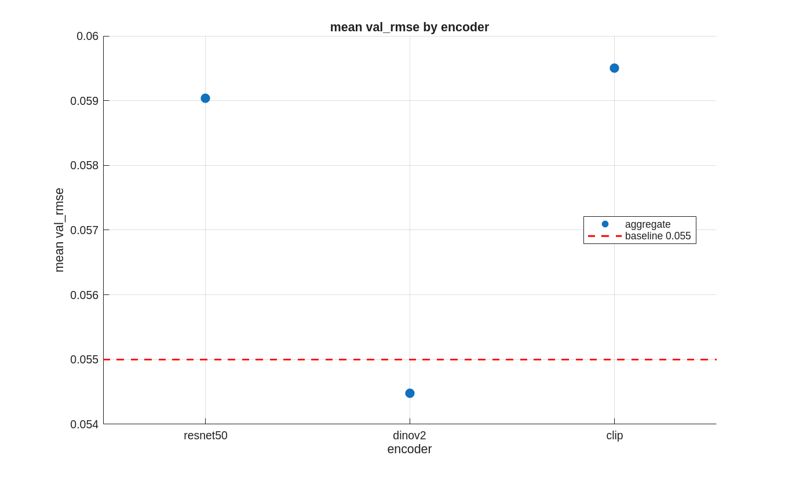

# MetaNaviT

<p align="center">
  
</p>

<p align="center">
  <a href="https://github.com/joses2017smjh/MetaNavT/actions/workflows/ci.yml"></a>
</p>

<p align="center">
  <strong>Hybrid search and cited answers over research files.</strong><br/>
  Retrieve current configurations, inspect the sources, and review proposed file changes.
</p>

<p align="center">
  <a href="#one-question"><strong>Watch the GIFs</strong></a>
  &nbsp;·&nbsp;
  <a href="#who-types-into-it">Who it is for</a>
  &nbsp;·&nbsp;
  <a href="#every-core-feature-shown">Features</a>
  &nbsp;·&nbsp;
  <a href="#the-number">Proof</a>
  &nbsp;·&nbsp;
  <a href="#how-the-app-is-put-together">Architecture</a>
  &nbsp;·&nbsp;
  <a href="#run-it">Run it</a>
</p>

## Engineering overview

Hybrid retrieval over research files, with cited source locations and reviewable file operations.
The committed benchmark is a frozen fixture scored with **hash embeddings and
overlap reranking**; it is not a measurement of a production corpus or a neural
embedding backend. Every number in this README's benchmark text is rendered from
[`bench/results/main.json`](bench/results/main.json) by `make bench-table`, and
`tests/eval/test_readme_numbers.py` fails if the text drifts from that file.

<!-- bench-headline:start (generated by `make bench-table` from bench/results/main.json; do not edit by hand) -->
On the frozen fixture (136 questions over 61 files; hash embeddings, overlap reranker) the full pipeline scores nDCG@10 0.493 [0.452, 0.538] and Recall@10 0.748 [0.691, 0.804]; BM25 alone scores nDCG@10 0.505 [0.454, 0.555] and Recall@10 0.730 [0.664, 0.793]. Paired delta, full pipeline minus BM25: nDCG@10 -0.013 [-0.063, +0.039] (the interval covers zero), Recall@10 +0.018 [-0.037, +0.080] (the interval covers zero). Staleness Tier 1 on vs off: nDCG@10 +0.036 [+0.027, +0.047] (the interval excludes zero). Of the added components (rerank, router, staleness), the nDCG@10 gain over the previous row that excludes zero: staleness. The router's exact-path gain, nDCG@10 0.875 → 0.938, rests on n = 8 questions. Recall@50 is 0.938 against 0.662 for a random list of the same length: with 40 unique files in a top-50 over 61, that metric mostly measures list length.
<!-- bench-headline:end -->

**Jose Sanchez's contribution:** retrieval and data APIs on the six-person
[project team](#team). The application combines a FastAPI backend, a Next.js
interface and PostgreSQL/pgvector; the committed retrieval benchmark runs
separately on CPU.

The [ablation table](#the-number) reports ranking quality (nDCG@10), coverage
(Recall@10, and Recall@50 next to a random-list baseline), paired deltas with
intervals, and the number of gold questions behind each category.

[Visual case study](https://jose-sanchez-portfolio-com.vercel.app/projects/metanavit/) ·
[Benchmark artifact](bench/results/latest.json) · [Run the CPU benchmark](#cpu-benchmark) · [Run the application](#run-it) · [Architecture](#how-the-app-is-put-together)

### CPU benchmark

From a clean clone, with Python 3.11 or 3.12. This path uses the committed
fixture, hash embeddings and overlap reranking; it needs no Ollama server,
Postgres instance, GPU or model download, and takes a few seconds.

```bash
pip install -e ".[eval]"   # numpy, pydantic, pytest
make test-eval             # evaluation tests
make bench                 # writes bench/results/<git-sha>.json and latest.json
make bench-gate            # latest.json vs the committed baseline bench/results/main.json
```

CI runs exactly this on every push and pull request (Python 3.11 and 3.12),
and fails if any config's nDCG@10, Recall@10 or Recall@50 drops more than 0.002 below
`main.json`. The bench is deterministic, so that threshold is rounding noise,
not tolerance. To accept a change on purpose: `make bench-baseline`, review
`make bench-compare`, commit `main.json`.

Keep the committed corpus when comparing against the published table. Use
`make freeze-corpus` only when intentionally rebuilding that benchmark input.

GitHub does not run `doc/demo.html` (it shows the source, which is why that link looked dead). The GIFs below are the preview. After clone: `open doc/demo.html`. The chrome is the app: `#121212`, lavender / gold / sky / pink radials from [`globals.css`](.frontend/app/globals.css).

---

## One question

> what's the current learning rate for the DINOv2 run 47

Three copies of that config exist. One still says `1e-5`. The live one says `3e-4`. The retrieval trace must identify which version is current and show its source.

<p align="center">
  
</p>

<p align="center">
  
</p>

This illustrated trace shows the intended interaction. Still frames of the same trace:

<p align="center">
  
</p>

Click-through version (local only): clone and open [`doc/demo.html`](doc/demo.html) in a browser. GitHub will not play it. Expand a gold item here:

<details>
<summary>what's the current learning rate for the DINOv2 run 47</summary>

```
route      semantic
search     BM25 + dense  →  RRF k=60  →  top-50
rerank     overlap teacher in CI; bge-reranker-v2-m3 when loaded
staleness  drop  configs/archive/run_047_v1.yaml   (1e-5, superseded)
cite       configs/run_047.yaml   bytes 0–312
answer     3e-4
gold       3e-4
```

</details>

<details>
<summary>which run had the lowest val RMSE</summary>

```
route   aggregation_query   (skip rerank)
search  BM25 over configs/ + results/ablation.csv
cite    configs/run_047.yaml  ·  results/ablation.csv
answer  47
```

</details>

<details>
<summary>open configs/run_047.yaml</summary>

```
route    lexical_path   (skip embed + rerank)
search   path lookup + BM25
cite     configs/run_047.yaml
nDCG@10  exact-path slice: router row vs reranked hybrid in the headline (n = 8)
```

</details>

<details>
<summary>does the current paper draft say fusion helps</summary>

```
tier 1   paper/draft_v2.md current;  draft_v1.md superseded
tier 2   CONFLICT  paper_claim/conclusion
         draft_v1: “fusion does not help”
         draft_v2: “fusion does help”
answer   yes  (draft_v2) — generator must address both
```

</details>

## Hard benchmark demos, generated

The polished trace above is not the only case. [`bench/demo/manifest.json`](bench/demo/manifest.json) selects nine hard questions from the frozen 136-question gold set, one committed negative control, and three explicitly labeled artifact/safety/visualization scenarios. The staleness cases below are measured mechanisms; the multi-hop graph, artifact, MATLAB and multimodal demos now sit under [Prototypes (not evaluated)](#prototypes-not-evaluated). `python -m app.eval.demo_export` runs the real offline stack and writes [`doc/demo/traces.json`](doc/demo/traces.json). The HTML and GIFs consume that file.

### Staleness under contradiction

<p align="center">
  
</p>

- `q115`: the archived `1e-5` config starts above the live config; Tier 1 removes it and surfaces the structural disagreement before answering `3e-4`.
- `q117`: Markdown-normalized Tier 2 catches `fusion **does** help` versus `fusion does not help`; the current draft remains rank 1.

### The loser stays visible

Blind graph expansion is the negative control: hops=1 raises Recall@50 `0.938 → 0.986` but lowers nDCG@10 `0.495 → 0.446` and takes roughly six times the wall time. Hops=2 falls to `0.350` nDCG@10. The default remains hops=0; PPR is a bounded rerank for aggregation and multi-hop only.

Regenerate everything with:

```bash
make demos
```

That is the product. Everything below is how it does that, who sits in front of it, and how to run it.

---

## Who types into it

<p align="center">
  
</p>

A researcher, a content manager, a data analyst, an engineer, a student. They do not want “semantic search.” They want a specific file to be the answer.

| They type | What has to happen |
|---|---|
| what's the current LR for DINOv2 run 47 | ignore `configs/archive/` |
| which run had the lowest val RMSE | aggregate configs + `ablation.csv` |
| what does the fusion module do | BM25 on `fusion.py`, dense on “fusion off” |
| open configs/run_047.yaml | skip embed and rerank |
| move logs/run_040.out into archive/ | plan only, until a human says yes |
| does the current draft say fusion helps | cite `draft_v2.md`, flag `draft_v1.md` as a conflict |

The frozen demo tree is 61 files: live YAML, archived YAML, Slurm, `.out` logs, checkpoint sidecars, two paper drafts, `src/fusion.py`, `results/ablation.csv`. Swap it later for a real capstone directory. The gold set is 136 questions over that tree, eight categories, no LLM judge.

---

## Every core feature, shown

### Hybrid search

File search is full of tokens embeddings smear: `run_047`, `--num_pairs=3`, `.sbatch`. BM25 catches those. Dense catches “the run where fusion was off.” Fuse with reciprocal rank fusion, `k=60`. Retrieve 50, rerank 8.

<p align="center">
  
</p>

ParadeDB BM25 in production (`ts_rank_cd` fallback). Dense is `<=>` on pgvector. Same query, two lists, one RRF ranking. That is the coverage jump in the table below, read next to its random-list baseline.

### A router that skips work

<p align="center">
  
</p>

Forty lines. No extra LLM. On the gold set: 8 queries skipped embed, 41 skipped rerank. Semantic recall did not move. The exact-path nDCG@10 gain over the reranked hybrid is in the [headline](#engineering-overview), with its n = 8; the old README compared the router row against plain RRF, which credited the reranker's share of that gain to the router.

### Retrieval inside the loop

<p align="center">
  
</p>



Hard cap on iterations. Unresolvable citation = failed generation. Empty retrieval refuses to guess. Specialized agents (file reader, Python exec, task router) still sit under FastAPI; retrieval is no longer a one-shot `top_k`.

### MCP filesystem, with a human interrupt

The same gate is exposed to the web UI as `/api/plans` (propose, list, approve, reject) with the approve/reject panel under the chat; see [How the app is put together](#how-the-app-is-put-together). `app/mcp/server_sdk.py` serves these tools through the official MCP Python SDK; `app/mcp/server.py` is the earlier hand-rolled JSON-RPC server, kept for clients pinned to it.

<p align="center">
  
</p>

Any MCP client can drive the corpus. OverlayFS already sandboxed file edits in the original app. The contract is now explicit in the tool:

| tool | contract |
|---|---|
| `search_semantic` / `search_lexical` | retrieve |
| `read_file(path, byte_range)` | citations resolve to bytes |
| `list_dir` / `stat` | navigate the tree, not just vectors |
| `propose_move` | returns a plan. never executes |
| `apply_plan` | requires `approved=true` |
| `collect_run_artifact` | ACM-style pack for a run (config, code, log, paper) |
| `propose_artifact` | spec → generate → sandbox. never writes |
| `apply_artifact` | requires `approved=true`; refuses a failed sandbox |
| `propose_patch` / `apply_patch` | SEARCH/REPLACE, same HITL |
| `exec_sandboxed` | AST-gated Python. no `os`, no pip |
| `inspect_spreadsheet` | schema, types, missingness, five-row preview |
| `propose_visualization` | aggregation preview + chart recommendation/alternatives; never writes |
| `apply_visualization` | user approves or overrides chart, then writes/runs MATLAB |

```python
plan = tools.propose_move("logs/run_040.out", "archive/run_040.out")
# {'status': 'pending_approval', 'plan_id': '...'}
tools.apply_plan(plan["plan_id"])                 # ApprovalRequired
tools.apply_plan(plan["plan_id"], approved=True)  # applied
```

### Cutting-edge query processing

Six techniques from 2023–2026 RAG research, wired into the bench harness with ablation flags.

**HyDE** (Hypothetical Document Embedding). Instead of embedding the raw query, generate a pseudo-document from the query tokens and embed that. The hypothesis is closer to the answer space, so cosine similarity is more meaningful. Fused with the original ranking via RRF. `app/retrieval/hyde.py`.

**Query Decomposition**. Compound multi-hop queries ("compare the learning rate and encoder between run 40 and run 47") are split into sub-queries, each retrieved independently, then merged by best-score dedup. Heuristic splitter (syntactic cues); LLM decomposition available when a model is loaded. `app/agent/decompose.py`.

**Corrective RAG (CRAG)**. After retrieval, classify each chunk as Correct / Ambiguous / Incorrect. If the correct ratio is below threshold, trigger corrective actions: refine ambiguous chunks to key sentences, rewrite the query with expanded terms, or decompose and retry. `app/agent/corrective.py`.

**Adaptive Retrieval**. Not every query needs the full pipeline. Greetings, meta-questions, and textbook definitions skip retrieval entirely. Corpus-specific signals (run IDs, file extensions, config terms) trigger retrieval. Neutral on the gold set — every gold question needs retrieval. `app/retrieval/adaptive.py`.

**Semantic Query Cache**. Near-duplicate queries ("learning rate run 47" vs "what is the learning rate for run 47") hit an in-memory LRU cache with cosine-similarity lookup (threshold 0.92) instead of re-running the full pipeline. TTL eviction prevents stale results. Optional JSON persistence. `app/retrieval/cache.py`.

**Citation Verification**. Post-generation gate: extract factual claims from the answer, verify each value and path against retrieved evidence, flag hallucinated numbers, and reject answers below a verification ratio threshold. `app/agent/citation_verify.py`.

All six are in `make bench-frontier` as `hybrid+hyde`, `hybrid+decompose`, `hybrid+corrective`, and `hybrid+hyde+corrective`.

### Graph + staleness

The file system already is a graph: containment, imports, config→checkpoint, same run id, co-modification. No invented edges.

Version clusters: same de-versioned stem + suffix, different content hash. Default retrieve the newest. Comparative questions (`what changed between run 40 and 47`) keep both.

Tier 2 runs at query time on the top-k only: same entity, disagreeing `learning_rate`, or two drafts that say fusion does / does not help. The generator gets a conflict note instead of a silent pick.

<p align="center">
  
</p>

One hop lifts Recall@50 **0.938 → 0.986** and drops nDCG@10 **0.495 → 0.446**, at ~6x wall clock. Two hops is worse. Default stays `graph_hops=0`. That split is the finding.

### Indexing that does not redo the whole tree

The Index Manager tracks path, mtime, and now a content hash on `indexed_files`. Unchanged bytes skip re-embed. Blocked system paths never enter the crawl. `ON CONFLICT` upserts keep Postgres current without dropping the table.

### pgvector knobs on a trade-off curve

<p align="center">
  
</p>

<p align="center">
  
</p>

`halfvec` is 2x smaller (same Recall@10 as float32 on this corpus). Binary quantization is 32x smaller and recovers 0.594 Recall@10 after a float rescoring pass. `m` / `ef_construction` at build; `ef_search` at query; iterative scans so a path/mtime filter does not silently under-return. The in-memory NSW analogue on **hash** vectors saturates around Recall@10 0.52 — that space is not a manifold. The same SQL lives on `VectorStoreManager.ensure_hnsw` / `ensure_halfvec` / `ensure_binary` for `bge-large`.

---

## The number

A frozen fixture, BEIR-style retrieval metrics, and 95% confidence intervals from
a seeded, paired bootstrap over the gold questions. No LLM judge. One design
change per row. Losers stay in the table. The table below, the headline in the
overview and the figures are all rendered from
[`bench/results/main.json`](bench/results/main.json) (`make bench-table`,
`make figures`); `tests/eval/test_readme_numbers.py` fails if they drift.

<p align="center">
  
</p>

<p align="center">
  
</p>

<!-- bench-table:start (generated by `make bench-table` from bench/results/main.json; do not edit by hand) -->
| config | nDCG@10 [95% CI] | Recall@10 [95% CI] | random list @10 | Recall@50 | random list @50 | unique files in top 50 | MRR@10 |
|---|---:|---:|---:|---:|---:|---:|---:|
| dense_only | 0.272 [0.226, 0.322] | 0.480 [0.408, 0.553] | 0.164 | 0.915 | 0.742 | 45.2 | 0.233 |
| bm25_only | 0.505 [0.454, 0.555] | 0.730 [0.664, 0.793] | 0.152 | 0.843 | 0.587 | 35.8 | 0.462 |
| hybrid | 0.454 [0.402, 0.511] | 0.662 [0.600, 0.727] | 0.164 | 0.938 | 0.751 | 45.8 | 0.430 |
| hybrid+rerank | 0.452 [0.412, 0.496] | 0.747 [0.690, 0.803] | 0.164 | 0.938 | 0.751 | 45.8 | 0.391 |
| hybrid+rerank+router | 0.456 [0.415, 0.502] | 0.745 [0.689, 0.801] | 0.158 | 0.938 | 0.714 | 43.5 | 0.402 |
| hybrid+rerank+router+staleness | 0.493 [0.452, 0.538] | 0.748 [0.691, 0.804] | 0.158 | 0.938 | 0.662 | 40.4 | 0.464 |

Paired deltas (same bootstrap resamples for both sides):

| config | Δ nDCG@10 vs bm25_only [95% CI] | Δ Recall@10 vs bm25_only [95% CI] | Δ nDCG@10 vs previous row [95% CI] |
|---|---:|---:|---:|
| dense_only | -0.233 [-0.293, -0.173] | -0.250 [-0.334, -0.161] | — |
| bm25_only | — | — | +0.233 [+0.173, +0.293] (vs dense_only) |
| hybrid | -0.051 [-0.093, -0.006] | -0.068 [-0.133, +0.004] | -0.051 [-0.093, -0.006] (vs bm25_only) |
| hybrid+rerank | -0.053 [-0.102, -0.003] | +0.017 [-0.039, +0.077] | -0.002 [-0.040, +0.036] (vs hybrid) |
| hybrid+rerank+router | -0.049 [-0.098, +0.004] | +0.015 [-0.039, +0.077] | +0.005 [-0.009, +0.019] (vs hybrid+rerank) |
| hybrid+rerank+router+staleness | -0.013 [-0.063, +0.039] | +0.018 [-0.037, +0.080] | +0.036 [+0.027, +0.047] (vs hybrid+rerank+router) |

Per category, hybrid+rerank+router+staleness (n is the number of gold questions; no intervals at these sizes):

| category | n | nDCG@10 | Recall@10 | Recall@50 |
|---|---:|---:|---:|---:|
| simple_factual | 80 | 0.485 | 0.800 | 0.919 |
| conditional | 8 | 0.235 | 0.494 | 0.950 |
| comparative | 8 | 0.363 | 0.542 | 1.000 |
| aggregation | 10 | 0.333 | 0.465 | 1.000 |
| multi_hop | 8 | 0.493 | 0.656 | 0.938 |
| staleness | 8 | 0.547 | 0.875 | 1.000 |
| exact_path | 8 | 0.938 | 1.000 | 1.000 |
| semantic | 6 | 0.707 | 0.750 | 0.833 |

Per-category paired deltas vs parent, where the mechanism targets one category (small n, no claim beyond the slice):

- `hybrid+rerank+router` vs `hybrid+rerank` on `exact_path`, n = 8 (small n): nDCG@10 +0.062 [+0.000, +0.188] (the interval covers zero), Recall@10 +0.000 [+0.000, +0.000].
- `hybrid+rerank+router+staleness` vs `hybrid+rerank+router` on `staleness`, n = 8 (small n): nDCG@10 +0.064 [+0.009, +0.155] (the interval excludes zero), Recall@10 +0.000 [+0.000, +0.000].

Intervals: percentile bootstrap over queries, one index matrix shared by all configs (paired deltas); 2000 resamples, seed 0, numpy.random.RandomState.randint. Results file sha ee782ab, corpus sha f1ba038674e7.
<!-- bench-table:end -->

**Why Recall@50 is not the headline.** On a corpus this small a top-50 list
covers most of the tree, so a random list of the same length already scores what
the "random list, same length" column shows; read Recall@50 only next to that
column, and prefer Recall@10, where the same random baseline is a small fraction
of the score.

<p align="center">
  
</p>

**How to read the rows.**

- `dense_only`: hash embeddings retrieve wide and rank badly.
- `bm25_only`: exact tokens still win aggregate ranking; it returns fewer distinct files, which is why its Recall@50 sits below the rest.
- `hybrid`: RRF over both lists. Coverage up, aggregate ranking down against BM25 alone (the paired delta excludes zero).
- `+ overlap rerank`: the fallback reranker. No measurable change against plain RRF on aggregate nDCG@10 (its paired delta covers zero); it stays in the table until `bge-reranker-v2-m3` is measured (M2).
- `+ router`: skips embedding and reranking on exact-path queries; the gain is on that slice only and rests on n = 8.
- `+ staleness T1`: prefers the current version of a file; the only added component (rerank, router, staleness) whose gain over the previous row excludes zero, as the headline states.

```bash
make bench            # bench/results/<git-sha>.json and latest.json
make bench-compare    # latest.json vs bench/results/main.json (report)
make bench-gate       # same, exit 1 on regression (what CI runs)
make bench-table      # renders the generated blocks from main.json (bench-table-write updates them in place)
make figures          # regenerates the SVGs above
make sweeps           # HNSW, halfvec, hops, GraphRAG
make test-eval
```

---

## Real models, and a corpus where k=50 means something

The table above is the CPU/CI story: hash embeddings and an overlap reranker so
`make bench` runs anywhere in seconds. These two tables are the same pipeline
with real models. They are committed artifacts, produced by the command in each
results file header on the recorded device; CI does not download models, and
`tests/eval/test_readme_numbers.py` keeps the text equal to the files.

**Fixture v1 with real models.**

<!-- bench-neural:start (generated by `make bench-table` from bench/results/neural.json; do not edit by hand) -->
Fixture v1 with real models (`make bench-neural`, cuda (Quadro RTX 8000), torch 2.5.1+cu121, sentence-transformers 6.1.0; results sha ee782ab). Each row names its parent (one change away); the paired delta is against that parent. Wall time is the whole row after a warm-up query.

| config | parent | models (revision) | nDCG@10 [95% CI] | Recall@10 [95% CI] | Δ nDCG@10 vs parent [95% CI] | Δ vs bm25_only | beats BM25? | wall s |
|---|---|---|---:|---:|---:|---:|:---:|---:|
| bm25_only | — | hash / overlap | 0.505 [0.454, 0.555] | 0.730 [0.664, 0.793] | — | — | n/a | 0.2 |
| dense_only@bge-small | bm25_only | BAAI/bge-small-en-v1.5@5c38ec7 | 0.565 [0.509, 0.619] | 0.751 [0.692, 0.806] | +0.060 [+0.002, +0.118] | +0.060 [+0.002, +0.118] | yes | 3.4 |
| hybrid@bge-small | dense_only@bge-small | BAAI/bge-small-en-v1.5@5c38ec7 | 0.696 [0.646, 0.745] | 0.820 [0.768, 0.872] | +0.131 [+0.087, +0.175] | +0.190 [+0.144, +0.234] | yes | 3.3 |
| hybrid+bge-rerank@hash | bm25_only | BAAI/bge-reranker-v2-m3@953dc6f | 0.814 [0.768, 0.858] | 0.881 [0.835, 0.924] | +0.308 [+0.262, +0.354] | +0.308 [+0.262, +0.354] | yes | 53.5 |
| hybrid+bge-rerank@bge-small | hybrid@bge-small | BAAI/bge-small-en-v1.5@5c38ec7, BAAI/bge-reranker-v2-m3@953dc6f | 0.812 [0.765, 0.856] | 0.879 [0.835, 0.921] | +0.116 [+0.076, +0.160] | +0.307 [+0.259, +0.353] | yes | 48.1 |
| hybrid+bge-rerank+router@bge-small | hybrid+bge-rerank@bge-small | BAAI/bge-small-en-v1.5@5c38ec7, BAAI/bge-reranker-v2-m3@953dc6f | 0.808 [0.762, 0.852] | 0.869 [0.824, 0.911] | -0.004 [-0.025, +0.016] | +0.302 [+0.254, +0.350] | yes | 36.7 |
| hybrid+bge-rerank+router+staleness@bge-small | hybrid+bge-rerank+router@bge-small | BAAI/bge-small-en-v1.5@5c38ec7, BAAI/bge-reranker-v2-m3@953dc6f | 0.824 [0.781, 0.865] | 0.873 [0.829, 0.915] | +0.017 [+0.008, +0.027] | +0.319 [+0.272, +0.364] | yes | 33.7 |
| dense_only@bge-base | bm25_only | BAAI/bge-base-en-v1.5@a5beb1e | 0.701 [0.647, 0.749] | 0.842 [0.791, 0.890] | +0.196 [+0.141, +0.249] | +0.196 [+0.141, +0.249] | yes | 3.9 |
| hybrid@bge-base | dense_only@bge-base | BAAI/bge-base-en-v1.5@a5beb1e | 0.756 [0.704, 0.804] | 0.846 [0.801, 0.891] | +0.056 [+0.022, +0.089] | +0.251 [+0.214, +0.290] | yes | 3.8 |

Hybrid RRF over dense bge-small: nDCG@10 +0.131 [+0.087, +0.175] (the interval excludes zero). bge-reranker-v2-m3 over that hybrid: nDCG@10 +0.116 [+0.076, +0.160] (the interval excludes zero). Router on top of the reranked hybrid: nDCG@10 -0.004 [-0.025, +0.016] (the interval covers zero). Staleness Tier 1 on top of that: nDCG@10 +0.017 [+0.008, +0.027] (the interval excludes zero). With the reranker on, the first stage stops mattering on this fixture: bge-small + reranker 0.812 vs hash + reranker 0.814, paired delta -0.002 [-0.009, +0.006] (the interval covers zero), because the reranker rescores 50 of 71 chunks.

Per-category paired deltas vs parent (small n):

- `hybrid+bge-rerank+router@bge-small` vs `hybrid+bge-rerank@bge-small` on `exact_path`, n = 8 (small n): nDCG@10 +0.201 [+0.046, +0.342] (the interval excludes zero), Recall@10 +0.000 [+0.000, +0.000].
- `hybrid+bge-rerank+router+staleness@bge-small` vs `hybrid+bge-rerank+router@bge-small` on `staleness`, n = 8 (small n): nDCG@10 +0.050 [+0.000, +0.142] (the interval covers zero), Recall@10 +0.000 [+0.000, +0.000].
<!-- bench-neural:end -->

**External benchmark: BEIR SciFact.** A 5k-document corpus where a top-50 list is
a small slice, with a published BM25 number to check our lexical baseline
against. The `bm25` row uses the BEIR analyzer (Porter stemming, Lucene
stopwords, k1=0.9, b=0.4); the `bm25@default-tokenizer` row is the fixture's
tokenizer, kept so the gap is visible.

<!-- bench-beir:start (generated by `make bench-table` from bench/results/beir_scifact.json; do not edit by hand) -->
BEIR SciFact test split (`make bench-beir`): 5183 documents (title + ' ' + text), 300 queries; cuda (Quadro RTX 8000), torch 2.5.1+cu121, sentence-transformers 6.1.0; results sha ee782ab. Published BM25 nDCG@10 = 0.6789, [Anserini BEIR regression, flat BM25](https://github.com/castorini/anserini/blob/master/docs/regressions/regressions-beir-v1.0.0-scifact.flat.md), Lucene English (Porter stemming + stopwords), k1=0.9, b=0.4. Each row names its parent; per-query p50/p95 exclude build (index, document embeddings, model load: the build column) and one warm-up query.

| config | parent | models (revision) | reranker precision / max_length / depth | nDCG@10 [95% CI] | Recall@10 [95% CI] | Recall@100 [95% CI] | Δ nDCG@10 vs parent [95% CI] | Δ vs bm25 | beats BM25? | p50 / p95 ms | build s |
|---|---|---|---|---:|---:|---:|---:|---:|:---:|---:|---:|
| bm25 | — | hash / overlap | — | 0.677 [0.630, 0.719] | 0.803 [0.757, 0.845] | 0.929 [0.899, 0.956] | — | — | n/a | 19.43 / 29.24 | 16.3 |
| bm25@default-tokenizer | bm25 | hash / overlap | — | 0.601 [0.552, 0.649] | 0.718 [0.665, 0.766] | 0.821 [0.776, 0.862] | -0.076 [-0.104, -0.047] | -0.076 [-0.104, -0.047] | no | 28.48 / 41.56 | 0.5 |
| dense@bge-small | bm25 | BAAI/bge-small-en-v1.5@5c38ec7 | — | 0.720 [0.674, 0.761] | 0.845 [0.802, 0.885] | 0.953 [0.927, 0.973] | +0.043 [+0.011, +0.077] | +0.043 [+0.011, +0.077] | yes | 17.09 / 37.12 | 9.9 |
| dense@bge-small+instruction | dense@bge-small | BAAI/bge-small-en-v1.5@5c38ec7 | — | 0.713 [0.668, 0.756] | 0.836 [0.792, 0.877] | 0.942 [0.913, 0.965] | -0.007 [-0.021, +0.005] | +0.036 [+0.003, +0.068] | yes | 19.07 / 41.98 | 0.0 |
| hybrid@bge-small | dense@bge-small | BAAI/bge-small-en-v1.5@5c38ec7 | — | 0.738 [0.694, 0.778] | 0.860 [0.820, 0.895] | 0.962 [0.937, 0.982] | +0.018 [-0.007, +0.041] | +0.061 [+0.039, +0.083] | yes | 36.81 / 53.48 | 0.0 |
| hybrid+bge-rerank@bge-small | hybrid@bge-small | BAAI/bge-small-en-v1.5@5c38ec7, BAAI/bge-reranker-v2-m3@953dc6f | fp32 / uncapped / top 20 | 0.752 [0.708, 0.792] | 0.865 [0.824, 0.902] | 0.962 [0.937, 0.982] | +0.014 [-0.010, +0.041] | +0.075 [+0.053, +0.101] | yes | 923.21 / 1745.23 | 5.6 |
| hybrid+bge-rerank@bge-small/fp16-512/top20 | hybrid+bge-rerank@bge-small | BAAI/bge-small-en-v1.5@5c38ec7, BAAI/bge-reranker-v2-m3@953dc6f | fp16 / 512 / top 20 | 0.754 [0.711, 0.794] | 0.871 [0.832, 0.908] | 0.962 [0.937, 0.982] | +0.002 [-0.008, +0.010] | +0.077 [+0.054, +0.102] | yes | 191.21 / 244.41 | 5.2 |
| hybrid+bge-rerank@bge-small/fp16-512/top50 | hybrid+bge-rerank@bge-small/fp16-512/top20 | BAAI/bge-small-en-v1.5@5c38ec7, BAAI/bge-reranker-v2-m3@953dc6f | fp16 / 512 / top 50 | 0.742 [0.697, 0.783] | 0.856 [0.814, 0.892] | 0.962 [0.937, 0.982] | -0.012 [-0.020, -0.005] | +0.065 [+0.041, +0.090] | yes | 378.08 / 413.1 | 0.0 |
| hybrid+bge-rerank@bge-small/fp16-512/top100 | hybrid+bge-rerank@bge-small/fp16-512/top50 | BAAI/bge-small-en-v1.5@5c38ec7, BAAI/bge-reranker-v2-m3@953dc6f | fp16 / 512 / top 100 | 0.736 [0.692, 0.779] | 0.850 [0.807, 0.887] | 0.962 [0.937, 0.982] | -0.005 [-0.011, -0.001] | +0.060 [+0.035, +0.085] | yes | 668.4 / 729.87 | 0.0 |

Our BM25 with the same analyzer and document text scores nDCG@10 0.677 against Anserini's published 0.6789 (-0.0022). Dense bge-small vs BM25: nDCG@10 +0.043 [+0.011, +0.077] (the interval excludes zero), p50 17.09 ms. The bge-v1.5 query instruction vs no instruction: nDCG@10 -0.007 [-0.021, +0.005] (the interval covers zero), p50 19.07 ms. Hybrid RRF over dense: nDCG@10 +0.018 [-0.007, +0.041] (the interval covers zero), p50 36.81 ms. bge-reranker-v2-m3 (top 20, fp32, uncapped) over the hybrid: nDCG@10 +0.014 [-0.010, +0.041] (the interval covers zero), p50 923.21 ms. fp16 with max_length 512 vs fp32 uncapped: nDCG@10 +0.002 [-0.008, +0.010] (the interval covers zero), p50 191.21 ms. Rerank depth 50 vs 20: nDCG@10 -0.012 [-0.020, -0.005] (the interval excludes zero), p50 378.08 ms. Depth 100 vs 50: nDCG@10 -0.005 [-0.011, -0.001] (the interval excludes zero), p50 668.4 ms.
<!-- bench-beir:end -->

**How to read these.** With real models the picture flips: hybrid RRF and the
cross-encoder both beat BM25 with intervals that exclude zero, on the fixture
and on SciFact, and the "beats BM25?" column is computed from those intervals,
not asserted. Every paired delta is against the row's named parent, one change
away, never against list order.

**Which benchmark carries which claim.** SciFact carries the retrieval-quality
claims: 5k documents, a published BM25 baseline to check against, a top-50 that
is a small slice. The fixture carries domain behaviours and regression checks:
exact-path routing, versioned configs (staleness), byte-range citations, and the
CI gate. On the fixture the first stage stops mattering once the reranker is
on, because the reranker rescores 50 of its 71 chunks; the generated sentence
above states the hash-versus-bge-small paired delta. Router and staleness are
fixture-specific mechanisms; their gains are reported per category with the
small n they rest on, and they are not part of the SciFact rows.

**Reranker settings are measured, not assumed.** The SciFact table keeps fp32
uncapped and fp16 with `max_length` 512 side by side, and sweeps the rerank
depth (20, 50, 100), each with its own p50/p95; the served configuration is
chosen from that table in the API section below, not picked up front.

---

## The API serves the benchmarked pipeline

`POST /api/retrieve/` is the same hybrid pipeline over Postgres + pgvector:
one parameterized SQL query ([hybrid_tsrank.sql](app/database/sql/hybrid_tsrank.sql))
with a pgvector top-k CTE (`<=>`, HNSW index), a full-text top-k CTE
(`websearch_to_tsquery` + `ts_rank_cd`, GIN index; ParadeDB BM25 when
`pg_search` is installed), and reciprocal rank fusion computed in SQL, then
staleness Tier 1 from the same `app/graph` code the bench uses. Every hit
carries `path`, `start_byte`, `end_byte`, `chunk_id` and its per-stage scores;
the response carries the route and per-stage latency. `k` is validated (1-50),
bad bodies are 422, a down backend is 503. The committed
[EXPLAIN (ANALYZE, BUFFERS)](doc/sql/hybrid_explain.txt) is the plan on fixture v1.
`tests/database/test_hybrid_sql.py` checks that the SQL fusion equals the Python
RRF on identical input lists, against a live Postgres in CI.

<!-- bench-parity:start (generated by `make bench-table` from bench/results/parity.json; do not edit by hand) -->
Same 136 questions, same metrics, same paired bootstrap (`make parity`, results sha 90ce661). The in-memory row is the bench harness with the switches the API serves in CI: hybrid RRF, router on, staleness Tier 1 on, no reranker, hash embeddings. The API row is POST /api/retrieve/ over Postgres + pgvector (one SQL round trip, app/database/sql/hybrid_tsrank.sql).

| row | nDCG@10 [95% CI] | Recall@10 [95% CI] | Recall@50 | lexical leg | chunker | p50 / p95 ms per query |
|---|---:|---:|---:|---|---|---:|
| in_memory:hybrid+router+staleness | 0.515 [0.462, 0.570] | 0.705 [0.643, 0.765] | 0.938 | in-memory Okapi BM25 | app/chunking (structure-aware) | 0.02 / 0.02 |
| api:postgres | 0.535 [0.493, 0.581] | 0.786 [0.736, 0.837] | 0.950 | ts_rank_cd | SentenceSplitter(512, 50) | 9.89 / 33.3 |

Gate: nDCG@10 gap, API minus in-memory, +0.0203 with paired 95% CI +0.020 [-0.026, +0.065] (the interval covers zero); tolerance 0.06; passes. The API's e2e latency is client-measured over HTTP on the machine that produced the results file; the in-memory figure is the search stage only.
<!-- bench-parity:end -->

The gap has known causes, and both rows are reported rather than one being
declared "the" number: the lexical legs differ (Okapi BM25 over the bench's
structure-aware chunks versus Postgres `ts_rank_cd` over OR-joined terms on
`SentenceSplitter` chunks), and so do the chunk boundaries; the dense leg uses
the same hash embeddings on different chunk texts. Path-level relevance absorbs
most of the chunking difference. CI's `parity` job runs this on every push.

**Served reranker configuration, chosen from the SciFact table.** With a
reranker configured, the API reranks the fused top 20 (`RERANK_DEPTH`) and
keeps the rest of the fused list in RRF order, with `max_length` 512
(`RERANKER_MAX_LENGTH`) and fp16 weights on CUDA or fp32 on CPU
(`RERANKER_PRECISION`). The sweep above is the reason: fp16 with a 512-token
cap is a quality tie with fp32 uncapped at a fraction of the latency, and
reranking deeper than 20 loses nDCG@10 while costing more. The CI stack serves
no reranker; the `ml` override serves this one on CPU.

**No silent fallbacks.** `RERANKER_MODEL` set but not loadable is a startup
error (`/health` 503 with the reason) unless `RERANKER_REQUIRED=false`, in
which case `/health` reports `degraded` and every response lists the missing
component. A reranker call that fails at request time serves that request in
RRF order and says so in `degraded`; the lexical leg failing in Python mode
does the same. `/health` reports the reranker's model, revision, device,
precision, `max_length` and depth. `tests/engine/test_hybrid_retriever.py`
fails if a configured reranker could fall back without a trace.

<!-- api-latency:start (generated by `make bench-table` from bench/results/api_latency_*.json; do not edit by hand) -->
_no api_latency_*.json yet; run `scripts/smoke_retrieve.py --latency bench/gold/questions.jsonl --latency-out ...` against a running API._
<!-- api-latency:end -->

---

## Does the judge agree with the gold labels?

`make bench-jury` generates a cited answer for every gold question with a local
model through Ollama, from the top 8 chunks of the best measured retrieval
configuration, then runs three deterministic checks before any judge is asked:
the cited path is in the retrieved set, every number or config value in the
answer appears inside the cited bytes (not merely somewhere in the evidence),
and exact match against the gold answer on the simple-factual slice. An answer
that carries no valid `[path:start-end]` citation fails loudly and is excluded
from judging. Two different judge models label each answer pointwise, and a
position-swapped (AB/BA) pairwise comparison against the extractive answer
measures their order bias. Judge scores are published only if a judge's
Cohen's kappa against the exact-match labels reaches the gate; otherwise the
table says so and the scores stay in the results file.

<!-- bench-jury:start (generated by `make bench-table` from bench/results/jury.json; do not edit by hand) -->
<!-- bench-jury:end -->

The heuristic token-overlap judge is kept as a labelled column for comparison
and is never an LLM result. The e2e columns of the older result files
(faithfulness, answer relevancy) are the same heuristic and are not on this
page.

---

## Prototypes (not evaluated)

Everything in this section runs and is shown in the GIFs, but none of it has a
measured result on the gold set or on an external benchmark. It is kept out of
the tables above on purpose: no number in this README describes these modules.
What is measured is the retrieval pipeline (the sections above); these are
demos of mechanisms built on top of it. Modules: `app/graph/graphrag.py`,
`app/graph/hipporag.py`, `app/artifacts/` (Paper2Code, spec / patch / sandbox),
`app/artifacts/visualization.py` (MATLAB), `app/multimodal/`, `app/rl/`.

### GraphRAG community summaries and HippoRAG PPR

_The community summary and the PPR rerank are demos; the measured graph result is the hops sweep in the Graph + staleness section, where blind expansion lost._


<p align="center">
  
</p>

Asked “what is in this corpus”:

```
[community 0] runs 40–55; encoders clip, dinov2, resnet50; 54 files
run:47  —uses_encoder→  dinov2
run:47  —has_learning_rate→  3e-4
```

### Multi-hop graph cases

_Hand-picked demo cases from the gold set, replayed with typed PPR rank fusion; not a category-level result._


<p align="center">
  
</p>

- `q107`: config/log evidence moves from best gold rank 22 to rank 4 for the baseline→minimum-RMSE→bark→config chain.
- `q108`: the requested Slurm evidence moves from rank 24 to rank 5 without adding any path outside the fused top-50.
- `q114`: lexical `src/trellis_wires.py` stays rank 1 while graph evidence brings runs 46/47/48 into the same context.
- `q100`: all five configs below the `0.0550` baseline remain covered. GraphRAG summarizes the global community; deterministic aggregation still computes the count.

PPR now fuses **ranks**, not raw PPR mass with RRF scores. Raw PPR was on a different scale and could swamp a strong lexical hit. A typed path prior (`source`, `slurm`, `checkpoint`, `paper`, `config`) only reranks candidates already retrieved.

### Research and coding artifacts

_A deterministic scenario outside the retrieval gold set; labelled synthetic, not retrieval accuracy._


<p align="center">
  
</p>

`reproduce run 47 from the paper` now cites the live config, current draft, and source code; excludes `archive/` and `draft_v1`; executes in the restricted sandbox; and remains `pending_approval` until a human applies it. This is a deterministic scenario outside the retrieval gold set, so it is labeled synthetic rather than reported as retrieval accuracy.

### Artifacts and code production

_Paper2Code-style plan / analyze / generate over this corpus; no quality measurement exists for the generated artifacts._


The product is a research tree, so “generate code” has to mean two different jobs.

**Academia.** Pack a run the way a lab ships a reproducibility artifact: live YAML, Slurm, `.out` log, `src/fusion.py`, current paper draft. ACM-style badges: Available (files + hashes), Functional (sandbox tests pass), Reusable (env or paper + citations). Paper2Code (Seo et al., ICLR 2026) is plan → analyze → generate over *this* corpus, not a cloned GitHub repo. Claim-support: a generated `learning_rate` / encoder that is not in the citations is an unsupported claim.

**Industry.** Spec card (citations, tests, template) before any file is proposed. SEARCH/REPLACE patches. Restricted exec (no `os`, no pip). Write is HITL, same as `propose_move`. Templates are `python-lib` / `pytest` / `research-repro`, not the 2024 Next.js-13 demo list.

```python
art = tools.propose_artifact("reproduce run 47 from the paper")
# sandbox ran; status pending_approval
tools.apply_artifact(art["plan_id"])                 # ApprovalRequired
tools.apply_artifact(art["plan_id"], approved=True)  # writes artifacts/reproduce.py
```

### Spreadsheet to MATLAB, with a user checkpoint

_One frozen CSV, one trace, one chart; a demo of the approval checkpoint, not an evaluation._


The chatbot does not expose hidden chain-of-thought. It emits an **auditable decision trace**: observed schema → proposed aggregation → visualization rationale → alternatives → approval/override. Nothing is written before that checkpoint.

<p align="center">
  
</p>

For the frozen `results/ablation.csv`, the local trace finds eight rows and five columns, proposes `mean(val_rmse) by encoder`, and recommends a dot plot because the task compares point estimates with a `0.055` reference threshold. The user may override it with a bar or line chart.

```python
plan = tools.propose_visualization(
    "results/ablation.csv",
    "Compare average val RMSE by encoder against the 0.055 baseline",
)
# inspect plan["aggregated_rows"], plan["decision_trace"],
# plan["recommended_chart"], plan["alternatives"], plan["user_questions"]

tools.apply_visualization(plan["plan_id"])  # ApprovalRequired
tools.apply_visualization(
    plan["plan_id"],
    approved=True,
    chart_type="dot",  # user can override
    backend="matlab",
)
```

The generated [MATLAB source](doc/matlab/mean_val_rmse_by_encoder.m) reads and aggregates the CSV itself; the checked-in chart below was rendered by local MATLAB.

<p align="center">
  
</p>

```bash
python -m app.mcp.server bench/corpus/files
```

### Pages still look like pages

_ColPali-style page patches and CLIP / SigLIP images (`app/multimodal/`); no image or PDF questions exist in the gold set._


<p align="center">
  
</p>

PDFs are indexed as page images, not smashed-to-text. Patch grid → MaxSim. Tables and figures stay pixels. Storage is 10–20x a single-vector index, so this is an available mode, not the default path.

Renders and plots go through CLIP/SigLIP when the model is local, pixel-hash otherwise. One query, three retrievers (text, page, image), fused with RRF.

### Search-R1 / GRPO

_The environment, reward, retrieved-token mask and a CPU dummy GRPO step live in `app/rl/`; nothing is trained. See "What we are not claiming"._

---

## How the app is put together

<p align="center">
  
</p>

```
                    MCP client or localhost:8000
                                |
                    route  (40 lines, no extra LLM)
                     |         |          |
                 lexical   aggregation   plan
                                           |
                              BM25 ──┐
                                     ├─ RRF ─ rerank ─ grade ─ rewrite?
                              dense ─┘              |
                                               graph hops
                                               staleness T1/T2
                                               page MaxSim / images
                                                    |
                                              cite (path + bytes)
                                              or fail loud
```

**Frontend.** Next.js in `.frontend/`. Chat, and a file-plans panel (`app/components/plans-panel.tsx`) that lists proposed moves and approves or rejects them through `POST /api/plans/{id}/approve` and `/reject`; nothing moves until that click, and every decision is logged in Postgres (`plan_decisions`). Pending plans live in the API process's memory (one worker); the decision log is the durable record and `GET /api/plans/decisions/recent` reads it back. The page background is the four-stop radial gradient in `globals.css`.

**Backend.** FastAPI in `app/`. Chat and retrieve routers, LlamaIndex engine, specialized tools (file access, Python exec, artifacts). Agents hand off through a task router. Retrieval is now hybrid + loop, not a single dense `top_k`.

**Database.** PostgreSQL with pgvector (dense) and ParadeDB / `ts_rank_cd` (BM25). Connection pooling in `DatabaseManager`. Vector schema and HNSW / halfvec / binary knobs on `VectorStoreManager`.

**Index Manager.** `app/database/index_manager.py` stores path, mtime, process version, content hash. Loaders crawl the tree, skip blocked paths, and only re-embed what changed.

**Sandbox.** OverlayFS dry-run for file mutations. MCP `propose_move` is the same idea as a staking interrupt: the destructive action does not run until `approved=true`.

**Eval harness.** Does not need Postgres or a GPU. In-memory BM25 + hash dense over `bench/corpus/files`. `make bench` is one command. The git history of `bench/results/*.json` is the ablation log.

Models in `.env`: `qwen2.5:14b` via Ollama, `BAAI/bge-large-en-v1.5` (1024d), `BAAI/bge-reranker-v2-m3` when loaded. CI uses the overlap teacher so the table never pretends.

---

## Run it

`pyproject.toml` is the single dependency spec. Pick the extra for what you
want to run (`requirements.txt` is generated from it by `make lock`):

| extra | installs | for |
|---|---|---|
| `eval` | numpy, pydantic, pytest | `make bench`, `make test-eval` (the CPU benchmark above) |
| `app` | FastAPI, LlamaIndex, psycopg2/pgvector | the API and the Postgres path |
| `ml` | torch, sentence-transformers, HF embeddings | real embedders and the bge reranker |

**Retrieval API with Docker.** One command; no Ollama, no model download.
The first start indexes `bench/corpus/files` (61 files) into pgvector with
the deterministic hash embedder, and `/health` reports what is loaded.

```bash
git clone https://github.com/joses2017smjh/MetaNavT.git
cd MetaNavT
docker compose up --build            # Postgres + pgvector, then the API on :8000

curl -s localhost:8000/health
curl -s -X POST localhost:8000/api/retrieve/ \
     -H 'content-type: application/json' \
     -d '{"query": "current learning rate for run 47"}'
python3 scripts/smoke_retrieve.py     # the check CI runs: hits, every hit has a path
```

The compose stack is labelled honestly: `pgvector/pgvector:pg16` has no
ParadeDB `pg_search`, so lexical search falls back to Postgres `ts_rank_cd`
(`bm25_backend` in the response), embeddings are the hash adapter
(`embedding_provider`), and no reranker is loaded (`reranker_loaded`). For
real models use the override, which installs the `ml` extra and loads
bge-large-en-v1.5 (~1.3 GB download) and bge-reranker-v2-m3:

```bash
docker compose down -v   # the table width changes from 256 to 1024
docker compose -f docker-compose.yml -f docker-compose.ml.yml up --build
```

**Full application locally** (chat needs Ollama; retrieval does not):

```bash
pip install -e ".[eval,app]"         # add ,ml for real embeddings / reranker
cp .env.example .env                 # RETRIEVE_K=50, RERANK_TOP_N=8, ENABLE_ROUTER=true
docker compose up db                 # or any Postgres with pgvector
ollama serve && ollama pull qwen2.5:14b

./scripts/run.sh generate            # index DATA_DIR (config/loaders.yaml)
./scripts/run.sh dev                 # API + Next.js dev server, http://localhost:8000
```

Set `EMBEDDING_PROVIDER=hash` to run the Postgres path without the `ml` extra,
and `RERANKER_MODEL=BAAI/bge-reranker-v2-m3` for the real cross-encoder row.

To freeze *your* capstone tree: snapshot the directory, hash `MANIFEST.json`, draft questions with an LLM, then hand-correct. Do not ship synthetic-only gold over a real corpus.

---

## What we are not claiming

**RL search policy (Search-R1 / GRPO) is not GPU-trained.** The env, reward, retrieved-token mask, and a CPU dummy GRPO step live in `app/rl/`. veRL + Qwen is still a training run. See [PLAN.md](PLAN.md) Phase 10.

**The CI table's rerank row is the overlap teacher**, not `BAAI/bge-reranker-v2-m3`; it is within noise of plain RRF (see the [ablation table](#the-number)). The real reranker is measured in the [real-models tables](#real-models-and-a-corpus-where-k50-means-something), which are committed artifacts rather than CI output. Until M2 the cross-encoder was called through the wrong API (`compute_score` instead of sentence-transformers' `predict`). In the bench, the weights were never cached, so `get_cross_encoder()` returned nothing and the row fell back to overlap for lack of weights; the first run with weights present raised. In the production retriever the same call was inside a broad `except`, so reranking silently returned the RRF order. No earlier "bge-rerank" number in this repository's history was a cross-encoder result; `reranker_loaded` in the results file is the check.

**E2E scores in the older result files are token overlap.** The LLM evaluation with its validity gate is the [judge section](#does-the-judge-agree-with-the-gold-labels): deterministic checks first, then two judge models, and Cohen's κ vs the exact-match labels on simple_factual must reach 0.6 before a judge score is printed. Retrieval metrics stay BEIR-style and LLM-free.

---

## What's next

Phases 6–10 are implemented as code. Remaining work is **measurement on GPU**, not missing modules:

1. Done in M4: `make bench-jury` runs the deterministic checks and the two-model jury; scores print only past the κ gate.
2. Done in M2: `make bench-neural` and `make bench-beir` measure bge-small / bge-base and the real reranker. Still open: distill the winner with `distill_winner`.
3. Optional: listwise RankGPT with a real LLM `complete` callable (CI uses overlap-listwise).
4. Optional: GPU Search-R1 / GRPO using the reward in `app/rl/reward.py`.

Full citations and abort conditions: [PLAN.md](PLAN.md).

---

## Layout

```
app/eval/          bench harness, metrics, jury, sweeps, SVG figures
app/retrieval/     RRF, BM25, router, distill, RankGPT, HNSW / halfvec / binary
app/chunking/      structure-aware, late, contextual
app/graph/         file graph, version clusters (measured), conflicts; GraphRAG, HippoRAG PPR (prototypes)
app/agent/         retrieval loop, Deep Research, move-plan schema
app/artifacts/     ACM bundles, Paper2Code, spec/patch/sandbox (prototype, not evaluated)
app/rl/            Search-R1 env, reward, GRPO dummy step (prototype, not evaluated)
app/mcp/           filesystem tools + stdio server
app/multimodal/    MaxSim, ColPali-style pages, CLIP/SigLIP images (prototype, not evaluated)
app/database/      index manager, pgvector, BM25
app/engine/        LlamaIndex agents, loaders, sandbox
.frontend/         Next.js UI
bench/corpus/      frozen files + MANIFEST
bench/gold/        136 questions
bench/results/     one JSON per git sha
doc/demo.html      clickable tour (open locally; GitHub will not run it)
doc/gifs/          looping previews that play in the README
doc/figures/       still charts
```

---

## Team

| | role |
|---|---|
| Deepti R. | Benchmark testing and documentation |
| Carlana S. | Benchmark testing and backend |
| Kaitlyn L. | DevOps / CI and benchmark infrastructure |
| John T. | Front-end / UX and execution sandbox |
| Kantaro N. | Retrieval and indexing |
| Jose S. | Retrieval and data APIs |

ravidatd@oregonstate.edu · soma@oregonstate.edu · lauriek@oregonstate.edu · tranj8@oregonstate.edu · nakanika@oregonstate.edu · sanchej7@oregonstate.edu

[PLAN.md](PLAN.md) is the modernization checklist and the v3 frontier plan (LLM jury, bge-m3 row, Search-R1). Issues that predate it: HITL UI [#74](https://github.com/klaurie/MetaNaviT/issues/74), ranking [#58](https://github.com/klaurie/MetaNaviT/issues/58), chunking [#22](https://github.com/klaurie/MetaNaviT/issues/22).
