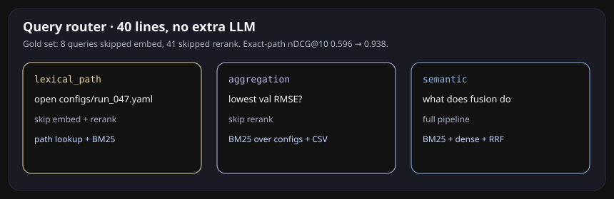
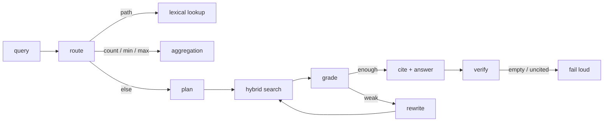
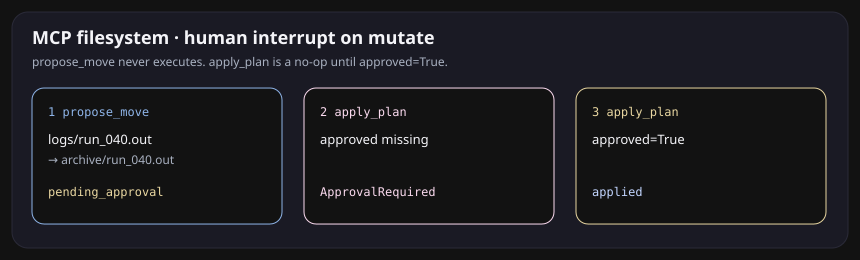
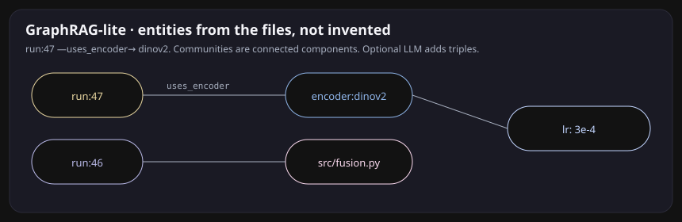

# MetaNaviT

<p align="center">
  
</p>

<p align="center">
  <strong>Search your own research tree like it has a memory.</strong><br/>
  Not an LLM file organizer. An agentic retrieval system over a frozen personal corpus,<br/>
  where every retrieval component was ablated and measured.
</p>

<p align="center">
  <a href="doc/demo.html"><strong>Open the live demo</strong></a>
  &nbsp;·&nbsp;
  <a href="#ask-it-something-it-should-not-be-allowed-to-bluff">The trace</a>
  &nbsp;·&nbsp;
  <a href="#the-number">The number</a>
  &nbsp;·&nbsp;
  <a href="#run-it">Run it</a>
</p>

<p align="center">
  
  
  
</p>

The palette is the app: `#121212` ground, lavender / gold / sky / pink radials from [`globals.css`](.frontend/app/globals.css). Same chrome you get at `localhost:8000`.

---

## Ask it something it should not be allowed to bluff

Gold question, not a brochure prompt:

> what's the current learning rate for the DINOv2 run 47

Three versions of that config exist. One of them says `1e-5`. The live one says `3e-4`. Generic RAG will happily quote the archive.

<p align="center">
  
</p>

<p align="center">
  
</p>

Same questions, clickable, in [`doc/demo.html`](doc/demo.html) (open locally — GitHub will not run the script). Expand a gold item here:

<details>
<summary>what's the current learning rate for the DINOv2 run 47</summary>

```
route      semantic
search     BM25 + dense  →  RRF k=60  →  top-50
rerank     overlap teacher in CI; bge-reranker-v2-m3 when loaded
staleness  drop  configs/archive/run_047_v1.yaml   (1e-5, superseded)
cite       configs/run_047.yaml   bytes 0–312
answer     3e-4
gold       3e-4
```

</details>

<details>
<summary>which run had the lowest val RMSE</summary>

```
route   aggregation_query   (skip rerank)
search  BM25 over configs/ + results/ablation.csv
cite    configs/run_047.yaml  ·  results/ablation.csv
answer  47
```

</details>

<details>
<summary>open configs/run_047.yaml</summary>

```
route    lexical_path   (skip embed + rerank)
search   path lookup + BM25
cite     configs/run_047.yaml
nDCG@10  0.938 on the exact-path slice  (0.596 without the router)
```

</details>

<details>
<summary>does the current paper draft say fusion helps</summary>

```
tier 1   paper/draft_v2.md current;  draft_v1.md superseded
tier 2   CONFLICT  paper_claim/conclusion
         draft_v1: “fusion does not help”
         draft_v2: “fusion does help”
answer   yes  (draft_v2) — generator must address both
```

</details>

---

## The number

136 questions over a 61-file frozen experiment tree (configs, Slurm, `.out` logs, ablation CSV, paper drafts, source). Retrieval metrics are BEIR-style. No LLM judge required.

<p align="center">
  
</p>

<p align="center">
  
</p>

| config | Recall@50 | nDCG@10 | MRR@10 | what it shows |
|---|---:|---:|---:|---|
| dense_only | 0.915 | 0.272 | 0.233 | Hash embeddings retrieve wide, rank badly |
| bm25_only | 0.843 | 0.505 | 0.462 | Exact tokens (run ids, flags) still win ranking |
| hybrid RRF | **0.938** | 0.454 | 0.430 | The Recall@50 jump the plan asked for |
| + overlap rerank | 0.938 | 0.452 | 0.391 | Loser. Stays in the table until `bge-reranker-v2-m3` |
| + router | 0.938 | 0.456 | 0.402 | Exact-path nDCG@10 **0.596 → 0.938** |
| + staleness T1 | 0.938 | **0.493** | **0.464** | Prefer current. No recall drop |

One design change at a time. Mean over the gold set. Report what lost.

```bash
make bench            # bench/results/<git-sha>.json
make bench-compare    # this sha vs main
make sweeps           # HNSW, halfvec, hops, GraphRAG
make figures          # regenerates the SVGs above
```

---

## What it actually does

### Hybrid search, not a slogan

BM25 (ParadeDB / `ts_rank_cd` fallback) plus dense (`<=>`). Fuse with reciprocal rank fusion, `k=60`. Retrieve 50, rerank 8.

File search is full of tokens embeddings smear: `run_047`, `--num_pairs=3`, `.sbatch`. BM25 catches those. Dense catches “the run where fusion was off.”

### A router that skips work

<p align="center">
  
</p>

On the gold set: 8 queries skipped embed, 41 skipped rerank. Semantic recall did not move. Exact-path nDCG@10 did.

### Retrieval inside the loop

<p align="center">
  
</p>



Hard cap on iterations. Unresolvable citation = failed generation. Empty retrieval refuses to guess.

### MCP filesystem, with a human interrupt

<p align="center">
  
</p>

| tool | contract |
|---|---|
| `search_semantic` / `search_lexical` | retrieve |
| `read_file(path, byte_range)` | citations resolve to bytes |
| `list_dir` / `stat` | navigate the tree, not just vectors |
| `propose_move` | returns a plan. never executes |
| `apply_plan` | requires `approved=true` |

```python
plan = tools.propose_move("logs/run_040.out", "archive/run_040.out")
# {'status': 'pending_approval', 'plan_id': '...'}
tools.apply_plan(plan["plan_id"])                 # ApprovalRequired
tools.apply_plan(plan["plan_id"], approved=True)  # applied
```

```bash
python -m app.mcp.server bench/corpus/files
```

### Graph + staleness, then GraphRAG

<p align="center">
  
</p>

Asked “what is in this corpus”:

```
[community 0] runs 40–55; encoders clip, dinov2, resnet50; 54 files
```

The file system already is a graph: containment, imports, config→checkpoint, same run id, co-modification. No LLM, no invented edges.

Version clusters: same de-versioned stem + suffix, different content hash. Default retrieve the newest; comparative questions (`what changed between run 40 and 47`) keep both.

Tier 2 runs at query time on the top-k only: same entity, disagreeing `learning_rate` / `val_rmse`, or two drafts that say fusion does / does not help. The generator gets a conflict note instead of a silent pick.

GraphRAG-lite layers entity triples (`run:47 —uses_encoder→ dinov2`) and connected-component summaries on top, so “what is in this corpus” has somewhere to land besides top-k chunks.

<p align="center">
  
</p>

Hop ablation is `make sweeps`. One hop lifts Recall@50 **0.938 → 0.986** and drops nDCG@10 **0.495 → 0.446**, at ~6x wall clock. Two hops is worse on both ranking and time. Default stays `graph_hops=0`. That split is the finding.

### Pages and pictures, scored like ColPali

<p align="center">
  
</p>

PDFs are indexed as **page images**, not smashed-to-text. Patch grid → MaxSim. Tables and figures stay pixels. Storage is 10–20x a single-vector index, so this is an available mode, not the default path.

Renders and plots go through CLIP/SigLIP when the model is local, pixel-hash otherwise. One query, three retrievers (text, page, image), fused with RRF.

### pgvector knobs that belong on a trade-off curve

<p align="center">
  
</p>

<p align="center">
  
</p>

`halfvec` is 2x smaller (same Recall@10 as float32 on this corpus). Binary quantization is 32x smaller and recovers 0.594 Recall@10 after a float rescoring pass. `m` / `ef_construction` at build; `ef_search` swept at query; iterative scans so a path/mtime filter does not silently under-return. The in-memory NSW analogue on **hash** vectors saturates around Recall@10 0.52 — that space is not a manifold. The same SQL lives on `VectorStoreManager.ensure_hnsw` / `ensure_halfvec` / `ensure_binary` for `bge-large`.

---

## Architecture

```
                    MCP client or localhost:8000
                                |
                    route  (40 lines, no extra LLM)
                     |         |          |
                 lexical   aggregation   plan
                                           |
                              BM25 ──┐
                                     ├─ RRF ─ rerank ─ grade ─ rewrite?
                              dense ─┘              |
                                               graph hops
                                               staleness T1/T2
                                               page MaxSim / images
                                                    |
                                              cite (path + bytes)
                                              or fail loud
```

Postgres + pgvector + ParadeDB for production. The bench harness does not need them: in-memory BM25 + dense over the frozen snapshot, so `make bench` is one command and the git history is the ablation log.

---

## Run it

```bash
conda create --name metanavit python=3.11
conda activate metanavit
pip install -r requirements.txt

ollama serve
ollama pull qwen2.5:14b

# eval only (no GPU, no Postgres)
make freeze-corpus
make bench
make test-eval

# full app
./scripts/run.sh generate
./scripts/run.sh dev
# http://localhost:8000

docker compose up
```

`.env` already points at `qwen2.5:14b` and `BAAI/bge-large-en-v1.5`. Set `RERANKER_MODEL=BAAI/bge-reranker-v2-m3` for the real cross-encoder row; the overlap teacher is what CI uses so the table never pretends.

To freeze *your* capstone tree: snapshot the directory, hash `MANIFEST.json`, draft questions with an LLM, then hand-correct. Do not ship synthetic-only gold over a real corpus.

---

## What we are not claiming

RL-trained search (Search-R1 / GRPO) is future work. The eval harness is the reward; the LangGraph-shaped loop with relevance grading is the production path until there is a reason to spend rollout compute.

The overlap reranker did not beat RRF. That number is in the table on purpose.

---

## Layout

```
app/eval/          bench harness, metrics, sweeps, SVG figures
app/retrieval/     RRF, BM25, router, distill, HNSW / halfvec / binary
app/chunking/      structure-aware, late, contextual
app/graph/         file graph, version clusters, GraphRAG, conflicts
app/agent/         retrieval loop, move-plan schema
app/mcp/           filesystem tools + stdio server
app/multimodal/    MaxSim, ColPali-style pages, CLIP/SigLIP images
bench/corpus/      frozen files + MANIFEST
bench/gold/        136 questions
bench/results/     one JSON per git sha
doc/demo.html      live traces, same gradient as the app
doc/figures/       README charts
```

---

## Team

Deepti R. · Carlana S. · Kaitlyn L. · John T. · Kantaro N. · Jose S.

[PLAN.md](PLAN.md) is the modernization checklist. Issues that predate it: HITL UI [#74](https://github.com/klaurie/MetaNaviT/issues/74), ranking [#58](https://github.com/klaurie/MetaNaviT/issues/58), chunking [#22](https://github.com/klaurie/MetaNaviT/issues/22).
