# MetaNaviT

<p align="center">
  
</p>

<p align="center">
  <strong>Search your own research tree like it has a memory.</strong><br/>
  Open localhost:8000. Ask what the current learning rate was.<br/>
  It cites the live YAML, not the archive that still says 1e-5.
</p>

<p align="center">
  <a href="#one-question"><strong>Watch the GIFs</strong></a>
  &nbsp;·&nbsp;
  <a href="#who-types-into-it">Who it is for</a>
  &nbsp;·&nbsp;
  <a href="#every-core-feature-shown">Features</a>
  &nbsp;·&nbsp;
  <a href="#the-number">Proof</a>
  &nbsp;·&nbsp;
  <a href="#how-the-app-is-put-together">Architecture</a>
  &nbsp;·&nbsp;
  <a href="#run-it">Run it</a>
</p>

<p align="center">
  
  
  
</p>

Not an LLM file organizer. An agentic retrieval system over a personal corpus, evaluated on a frozen benchmark, where every retrieval component was ablated and measured.

GitHub does not run `doc/demo.html` (it shows the source, which is why that link looked dead). The GIFs below are the preview. After clone: `open doc/demo.html`. The chrome is the app: `#121212`, lavender / gold / sky / pink radials from [`globals.css`](.frontend/app/globals.css).

---

## One question

> what's the current learning rate for the DINOv2 run 47

Three copies of that config exist. One still says `1e-5`. The live one says `3e-4`. Generic RAG quotes the archive. MetaNaviT has to refuse to.

<p align="center">
  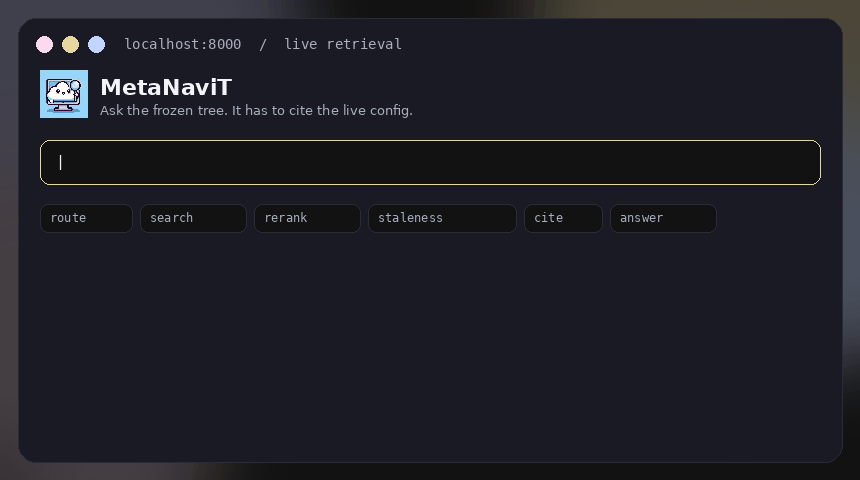
</p>

<p align="center">
  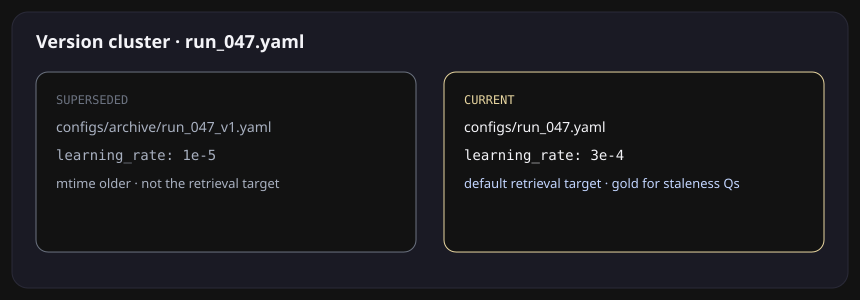
</p>

That loop is the product. Still frames of the same trace:

<p align="center">
  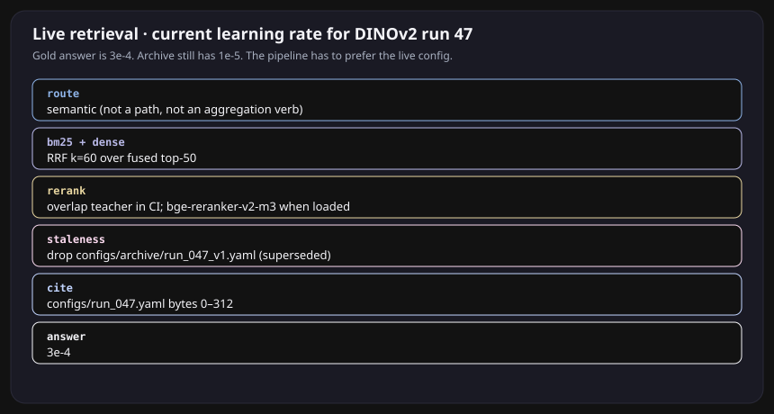
</p>

Click-through version (local only): clone and open [`doc/demo.html`](doc/demo.html) in a browser. GitHub will not play it. Expand a gold item here:

<details>
<summary>what's the current learning rate for the DINOv2 run 47</summary>

```
route      semantic
search     BM25 + dense  →  RRF k=60  →  top-50
rerank     overlap teacher in CI; bge-reranker-v2-m3 when loaded
staleness  drop  configs/archive/run_047_v1.yaml   (1e-5, superseded)
cite       configs/run_047.yaml   bytes 0–312
answer     3e-4
gold       3e-4
```

</details>

<details>
<summary>which run had the lowest val RMSE</summary>

```
route   aggregation_query   (skip rerank)
search  BM25 over configs/ + results/ablation.csv
cite    configs/run_047.yaml  ·  results/ablation.csv
answer  47
```

</details>

<details>
<summary>open configs/run_047.yaml</summary>

```
route    lexical_path   (skip embed + rerank)
search   path lookup + BM25
cite     configs/run_047.yaml
nDCG@10  0.938 on the exact-path slice  (0.596 without the router)
```

</details>

<details>
<summary>does the current paper draft say fusion helps</summary>

```
tier 1   paper/draft_v2.md current;  draft_v1.md superseded
tier 2   CONFLICT  paper_claim/conclusion
         draft_v1: “fusion does not help”
         draft_v2: “fusion does help”
answer   yes  (draft_v2) — generator must address both
```

</details>

That is the product. Everything below is how it does that, who sits in front of it, and how to run it.

---

## Who types into it

<p align="center">
  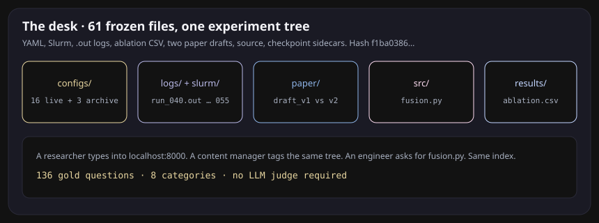
</p>

A researcher, a content manager, a data analyst, an engineer, a student. They do not want “semantic search.” They want a specific file to be the answer.

| They type | What has to happen |
|---|---|
| what's the current LR for DINOv2 run 47 | ignore `configs/archive/` |
| which run had the lowest val RMSE | aggregate configs + `ablation.csv` |
| what does the fusion module do | BM25 on `fusion.py`, dense on “fusion off” |
| open configs/run_047.yaml | skip embed and rerank |
| move logs/run_040.out into archive/ | plan only, until a human says yes |
| does the current draft say fusion helps | cite `draft_v2.md`, flag `draft_v1.md` as a conflict |

The frozen demo tree is 61 files: live YAML, archived YAML, Slurm, `.out` logs, checkpoint sidecars, two paper drafts, `src/fusion.py`, `results/ablation.csv`. Swap it later for a real capstone directory. The gold set is 136 questions over that tree, eight categories, no LLM judge.

---

## Every core feature, shown

### Hybrid search

File search is full of tokens embeddings smear: `run_047`, `--num_pairs=3`, `.sbatch`. BM25 catches those. Dense catches “the run where fusion was off.” Fuse with reciprocal rank fusion, `k=60`. Retrieve 50, rerank 8.

<p align="center">
  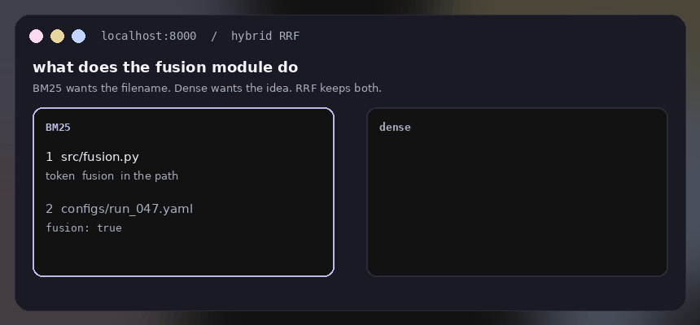
</p>

ParadeDB BM25 in production (`ts_rank_cd` fallback). Dense is `<=>` on pgvector. Same query, two lists, one RRF ranking. That is the Recall@50 jump in the table below.

### A router that skips work

<p align="center">
  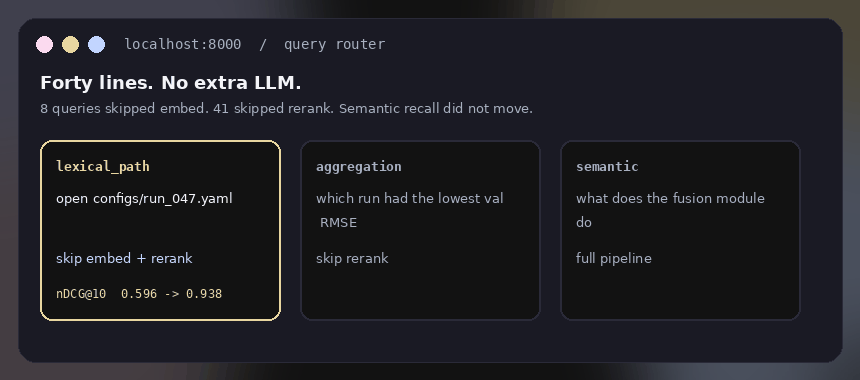
</p>

Forty lines. No extra LLM. On the gold set: 8 queries skipped embed, 41 skipped rerank. Semantic recall did not move. Exact-path nDCG@10 **0.596 → 0.938**.

### Retrieval inside the loop

<p align="center">
  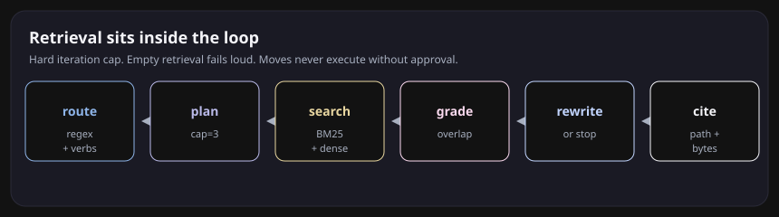
</p>

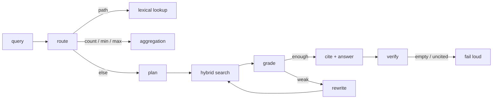

Hard cap on iterations. Unresolvable citation = failed generation. Empty retrieval refuses to guess. Specialized agents (file reader, Python exec, task router) still sit under FastAPI; retrieval is no longer a one-shot `top_k`.

### MCP filesystem, with a human interrupt

<p align="center">
  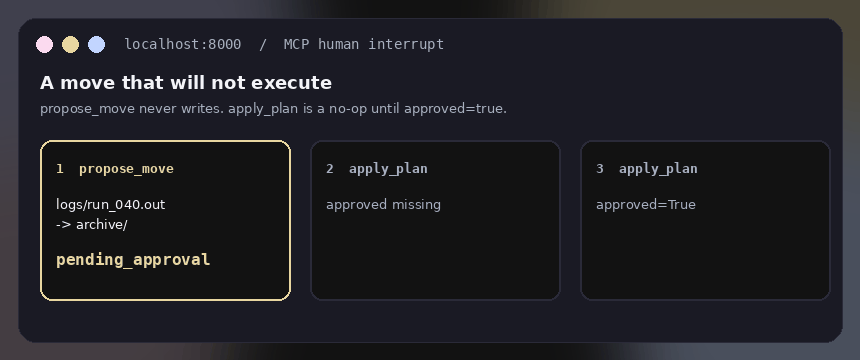
</p>

Any MCP client can drive the corpus. OverlayFS already sandboxed file edits in the original app. The contract is now explicit in the tool:

| tool | contract |
|---|---|
| `search_semantic` / `search_lexical` | retrieve |
| `read_file(path, byte_range)` | citations resolve to bytes |
| `list_dir` / `stat` | navigate the tree, not just vectors |
| `propose_move` | returns a plan. never executes |
| `apply_plan` | requires `approved=true` |

```python
plan = tools.propose_move("logs/run_040.out", "archive/run_040.out")
# {'status': 'pending_approval', 'plan_id': '...'}
tools.apply_plan(plan["plan_id"])                 # ApprovalRequired
tools.apply_plan(plan["plan_id"], approved=True)  # applied
```

```bash
python -m app.mcp.server bench/corpus/files
```

### Graph + staleness, then GraphRAG

<p align="center">
  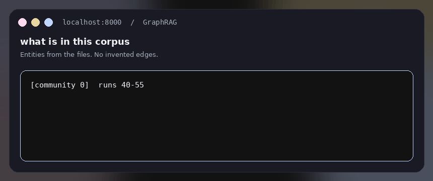
</p>

Asked “what is in this corpus”:

```
[community 0] runs 40–55; encoders clip, dinov2, resnet50; 54 files
run:47  —uses_encoder→  dinov2
run:47  —has_learning_rate→  3e-4
```

The file system already is a graph: containment, imports, config→checkpoint, same run id, co-modification. No invented edges.

Version clusters: same de-versioned stem + suffix, different content hash. Default retrieve the newest. Comparative questions (`what changed between run 40 and 47`) keep both.

Tier 2 runs at query time on the top-k only: same entity, disagreeing `learning_rate`, or two drafts that say fusion does / does not help. The generator gets a conflict note instead of a silent pick.

<p align="center">
  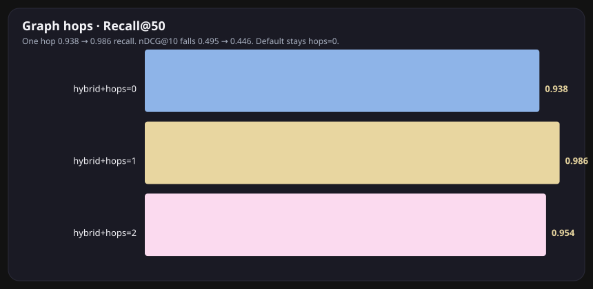
</p>

One hop lifts Recall@50 **0.938 → 0.986** and drops nDCG@10 **0.495 → 0.446**, at ~6x wall clock. Two hops is worse. Default stays `graph_hops=0`. That split is the finding.

### Pages still look like pages

<p align="center">
  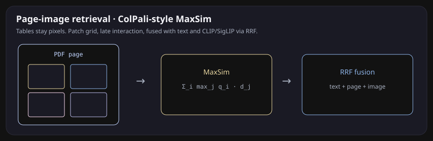
</p>

PDFs are indexed as page images, not smashed-to-text. Patch grid → MaxSim. Tables and figures stay pixels. Storage is 10–20x a single-vector index, so this is an available mode, not the default path.

Renders and plots go through CLIP/SigLIP when the model is local, pixel-hash otherwise. One query, three retrievers (text, page, image), fused with RRF.

### Indexing that does not redo the whole tree

The Index Manager tracks path, mtime, and now a content hash on `indexed_files`. Unchanged bytes skip re-embed. Blocked system paths never enter the crawl. `ON CONFLICT` upserts keep Postgres current without dropping the table.

### pgvector knobs on a trade-off curve

<p align="center">
  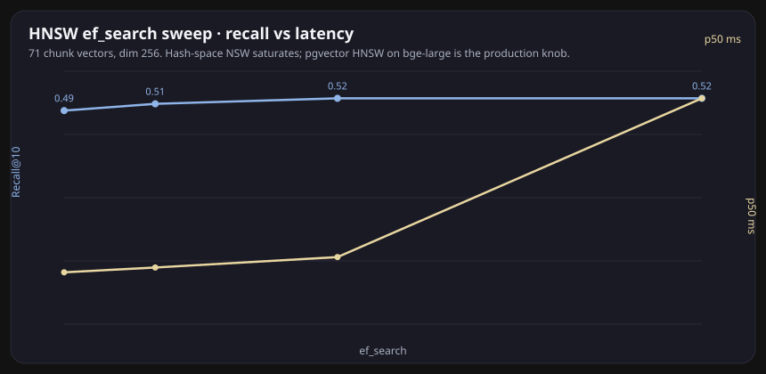
</p>

<p align="center">
  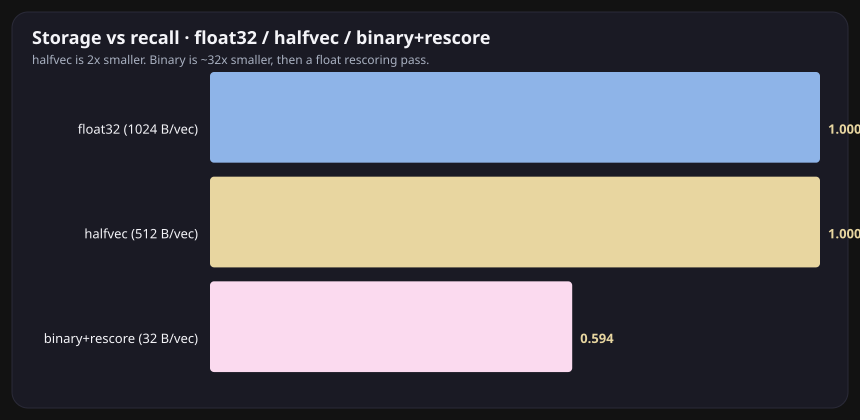
</p>

`halfvec` is 2x smaller (same Recall@10 as float32 on this corpus). Binary quantization is 32x smaller and recovers 0.594 Recall@10 after a float rescoring pass. `m` / `ef_construction` at build; `ef_search` at query; iterative scans so a path/mtime filter does not silently under-return. The in-memory NSW analogue on **hash** vectors saturates around Recall@10 0.52 — that space is not a manifold. The same SQL lives on `VectorStoreManager.ensure_hnsw` / `ensure_halfvec` / `ensure_binary` for `bge-large`.

---

## The number

136 questions. 61-file frozen tree. BEIR-style retrieval metrics. No LLM judge required. One design change at a time. Losers stay in the table.

<p align="center">
  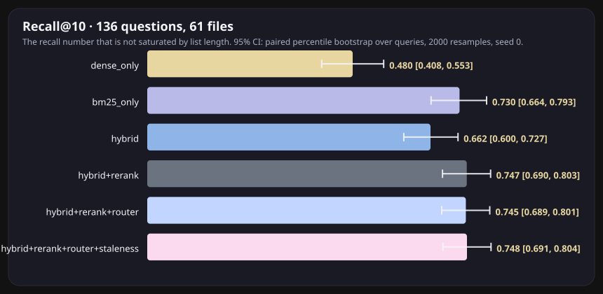
</p>

<p align="center">
  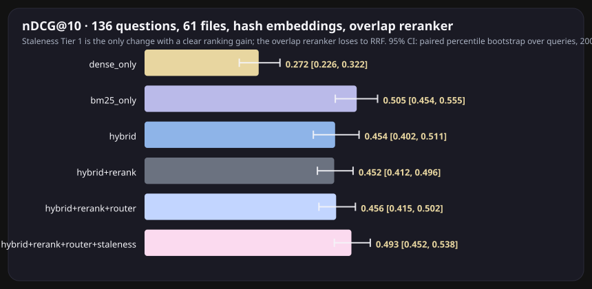
</p>

| config | Recall@50 | nDCG@10 | MRR@10 | what it shows |
|---|---:|---:|---:|---|
| dense_only | 0.915 | 0.272 | 0.233 | Hash embeddings retrieve wide, rank badly |
| bm25_only | 0.843 | 0.505 | 0.462 | Exact tokens still win ranking |
| hybrid RRF | **0.938** | 0.454 | 0.430 | The Recall@50 jump |
| + overlap rerank | 0.938 | 0.452 | 0.391 | Loser until `bge-reranker-v2-m3` |
| + router | 0.938 | 0.456 | 0.402 | Exact-path nDCG@10 **0.596 → 0.938** |
| + staleness T1 | 0.938 | **0.493** | **0.464** | Prefer current. No recall drop |

```bash
make bench            # bench/results/<git-sha>.json
make bench-compare    # this sha vs main
make sweeps           # HNSW, halfvec, hops, GraphRAG
make figures          # regenerates the SVGs above
make test-eval
```

---

## How the app is put together

<p align="center">
  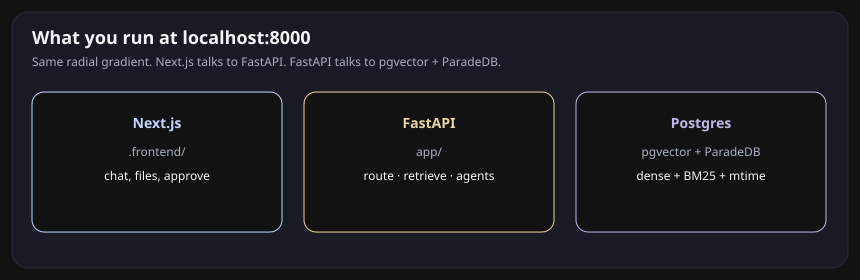
</p>

```
                    MCP client or localhost:8000
                                |
                    route  (40 lines, no extra LLM)
                     |         |          |
                 lexical   aggregation   plan
                                           |
                              BM25 ──┐
                                     ├─ RRF ─ rerank ─ grade ─ rewrite?
                              dense ─┘              |
                                               graph hops
                                               staleness T1/T2
                                               page MaxSim / images
                                                    |
                                              cite (path + bytes)
                                              or fail loud
```

**Frontend.** Next.js in `.frontend/`. Chat, file browser, human-in-the-loop approve/reject. The page background is the four-stop radial gradient in `globals.css`.

**Backend.** FastAPI in `app/`. Chat and retrieve routers, LlamaIndex engine, specialized tools (file access, Python exec, artifacts). Agents hand off through a task router. Retrieval is now hybrid + loop, not a single dense `top_k`.

**Database.** PostgreSQL with pgvector (dense) and ParadeDB / `ts_rank_cd` (BM25). Connection pooling in `DatabaseManager`. Vector schema and HNSW / halfvec / binary knobs on `VectorStoreManager`.

**Index Manager.** `app/database/index_manager.py` stores path, mtime, process version, content hash. Loaders crawl the tree, skip blocked paths, and only re-embed what changed.

**Sandbox.** OverlayFS dry-run for file mutations. MCP `propose_move` is the same idea as a staking interrupt: the destructive action does not run until `approved=true`.

**Eval harness.** Does not need Postgres or a GPU. In-memory BM25 + hash dense over `bench/corpus/files`. `make bench` is one command. The git history of `bench/results/*.json` is the ablation log.

Models in `.env`: `qwen2.5:14b` via Ollama, `BAAI/bge-large-en-v1.5` (1024d), `BAAI/bge-reranker-v2-m3` when loaded. CI uses the overlap teacher so the table never pretends.

---

## Run it

```bash
# Ollama
ollama serve
ollama pull qwen2.5:14b

# Python
conda create --name metanavit python=3.11
conda activate metanavit
pip install -r requirements.txt

# Postgres + pgvector (or)
docker compose up

# Index the documents in DATA_DIR, then the UI
./scripts/run.sh generate
./scripts/run.sh dev
# http://localhost:8000

# Eval only — no GPU, no Postgres
make freeze-corpus
make bench
make test-eval
```

`.env.example` already has `RETRIEVE_K=50`, `RERANK_TOP_N=8`, `ENABLE_ROUTER=true`. Copy to `.env`. Set `RERANKER_MODEL=BAAI/bge-reranker-v2-m3` for the real cross-encoder row.

To freeze *your* capstone tree: snapshot the directory, hash `MANIFEST.json`, draft questions with an LLM, then hand-correct. Do not ship synthetic-only gold over a real corpus.

---

## What we are not claiming

RL-trained search (Search-R1 / GRPO) is future work. The eval harness is the reward; the loop with relevance grading is the production path until there is a reason to spend rollout compute.

The overlap reranker did not beat RRF. That number is in the table on purpose.

---

## Layout

```
app/eval/          bench harness, metrics, sweeps, SVG figures
app/retrieval/     RRF, BM25, router, distill, HNSW / halfvec / binary
app/chunking/      structure-aware, late, contextual
app/graph/         file graph, version clusters, GraphRAG, conflicts
app/agent/         retrieval loop, move-plan schema
app/mcp/           filesystem tools + stdio server
app/multimodal/    MaxSim, ColPali-style pages, CLIP/SigLIP images
app/database/      index manager, pgvector, BM25
app/engine/        LlamaIndex agents, loaders, sandbox
.frontend/         Next.js UI
bench/corpus/      frozen files + MANIFEST
bench/gold/        136 questions
bench/results/     one JSON per git sha
doc/demo.html      clickable tour (open locally; GitHub will not run it)
doc/gifs/          looping previews that play in the README
doc/figures/       still charts
```

---

## Team

| | role |
|---|---|
| Deepti R. | Benchmark testing and documentation |
| Carlana S. | Benchmark testing and backend |
| Kaitlyn L. | DevOps / CI and benchmark infrastructure |
| John T. | Front-end / UX and execution sandbox |
| Kantaro N. | Retrieval and indexing |
| Jose S. | Retrieval and data APIs |

ravidatd@oregonstate.edu · soma@oregonstate.edu · lauriek@oregonstate.edu · tranj8@oregonstate.edu · nakanika@oregonstate.edu · sanchej7@oregonstate.edu

[PLAN.md](PLAN.md) is the modernization checklist. Issues that predate it: HITL UI [#74](https://github.com/klaurie/MetaNaviT/issues/74), ranking [#58](https://github.com/klaurie/MetaNaviT/issues/58), chunking [#22](https://github.com/klaurie/MetaNaviT/issues/22).
